# 1. Cài đặt Cinder csi.
- Tạo các file cài đặt:

    ```
    cinder-csi-controllerplugin-rbac.yaml
    cinder-csi-controllerplugin.yaml
    cinder-csi-nodeplugin-rbac.yaml
    cinder-csi-nodeplugin.yaml
    csi-cinder-driver.yaml
    csi-secret-cinderplugin.yaml
    ```
- Lưu ý sửa phần `cloud.conf` trong file `csi-secret-cinderplugin.yaml`.

- Dùng lệnh `kubectl apply -f` để áp dụng các file đã tạo.


    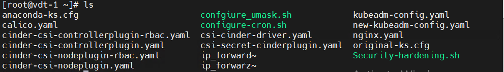

# 2. Test Dynamic Volume Provisioning

- Tạo file `nginx2.yaml` để tạo StorageClass, PersistentVolumeClaim và Pod.

- Dùng câu lệnh `kubectl -f nginx2.yaml create` để áp dụng file `nginx2.yaml`

- Đã tạo được `volume` với `StorageClass` vừa tạo.

    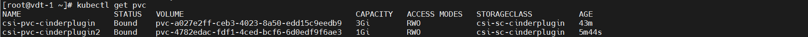

- Kiểm tra volume đã được tạo và attach vào pod

    ```
        $ ls /dev/vdb
        $ mount | grep vdb
        $ fdisk -l /dev/vdb | grep Disk
    ```

    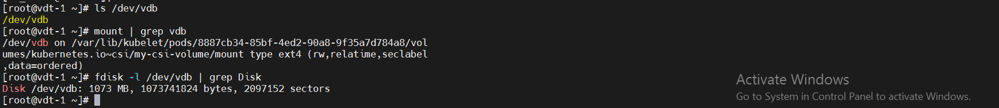

- Thử add file vào vị trí mount của pod:

    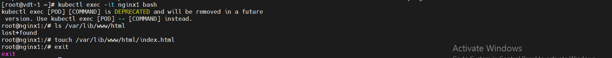

- Xóa pod:
    ```
        kubectl delete pod nginx1
    ```
- Sau đó volume sẽ ở trạng thái available

# 3. Test Snapshot Create and Restore
- Trước hết ta cần cài đặt VolumeSnapshot CRDs.
    - Tạo các file:
        - snapshot.storage.k8s.io_volumesnapshotclasses.yaml
        - snapshot.storage.k8s.io_volumesnapshotcontents.yaml
        - snapshot.storage.k8s.io_volumesnapshots.yaml
    - Dùng câu lệnh `kubectl apply -f` để chạy các file.
    - Check kết quả: 


        ```
        kubectl api-resources | grep volumesnapshot
        ```
        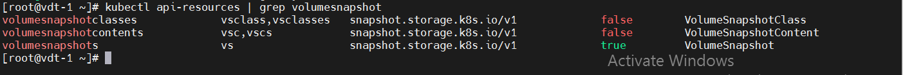
- Cài đặt `snapshot controller`:
    - Tạo các file:    `rbac-snapshot-controller.yaml` và `setup-snapshot-controller.yaml`
    - Apply các file: `kubectl apply -f`
    - Kết quả:
        ```
        kubectl get pods -A
        ```

        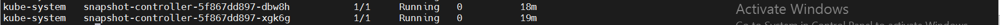
 
- Các file cần chuẩn bị: 
    - example.yaml
    - snapshotcreate.yaml
    - snapshotrestore.yaml
- Triển khai app , Tạo Storage Class, Snapshot Class và PVC
    ```
        kubectl apply -f example.yaml
    ```
- Kiểm tra trạng thái của PVC mới tạo: 
    ```
        kubectl get pvc
    ```


    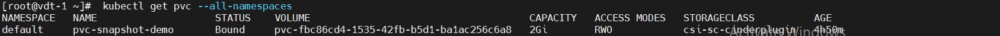

- Tạo Snapshot của PVC.
    ```
        kubectl apply -f snapshotcreate.yaml
    ```
- Kiểm tra Snapshot đã được tạo:
    ```
        kubectl get volumesnapshot
    ```

    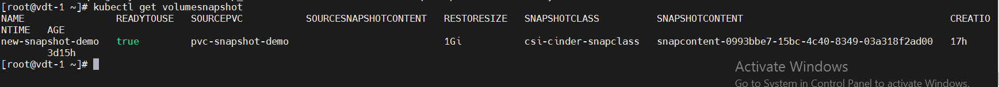

- Restore volume từ snapshot
    ```
        kubectl apply -f snapshotrestore.yaml
    ```
- Kiểm tra volume từ snapshot đã được tạo:
    ```
        kubectl get pvc
    ```

    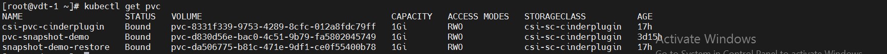

# 4. Test Using Block Volume
- Triển khai app mẫu:
    ```
        kubectl create -f block.yaml
    ```

- Check Pod:
    ```
        kubectl get pods
    ```

- Check xem node được mounted vào bên trong container chưa:

    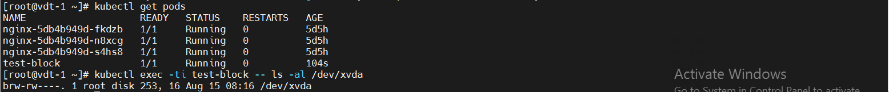

# 5. Test Inline Volumes

- Create a pod with inline volume
    ```
        kubectl apply -f csi-ephemeral-volumes-example.yaml
    ```

- Get the pod description, verify created volume in Volumes section

    ```
        kubectl describe pod inline-pod
    ```

    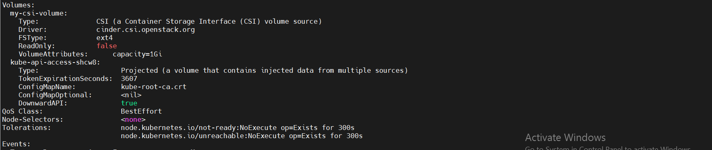

# 6. Test Volume Expansion Example

- Sample App definition for volume resize: `sampleapp.yaml`

- Deploy Sample App:
    ```
        kubectl apply -f sampleapp.yaml
    ```
- Verify PV is created and bound to PVC
    
    ```
        kubectl get pvc
    ```

- Check Pod is in `Running` state

    ```
        kubectl get pods 
    ```
- Check current filesystem size on the running pod
    ```
         kubectl exec nginx -- df -h /var/lib/www/html
    ```

    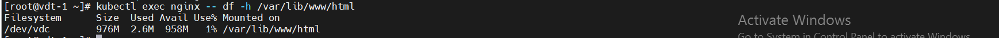
- Resize volume by modifying the field `spec -> resources -> requests -> storage`
    ```
        kubectl edit pvc csi-pvc-cinderplugin
    ```

    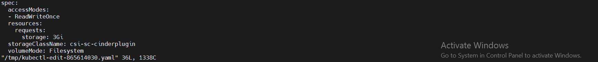

- Verify filesystem resized on the running pod
    ```
        kubectl exec nginx -- df -h /var/lib/www/html
    ```
    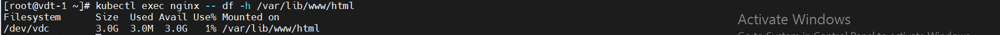
- Describe pod to see events:
    ```
        kubectl describe pod nginx
    ```

    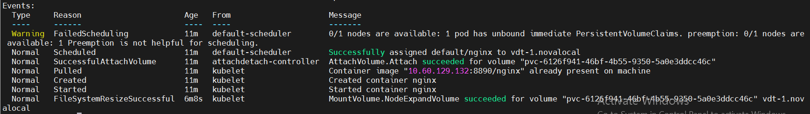

    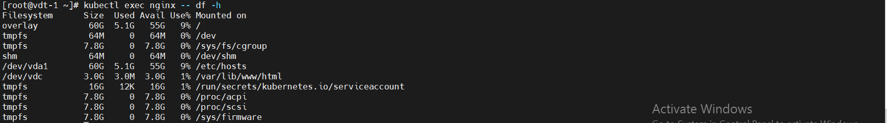


    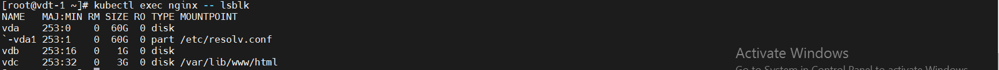

# Ref
[1] [Setup-Cinder-csi](https://github.com/kubernetes/cloud-provider-openstack/tree/master/manifests/cinder-csi-plugin)

[2] [Test](https://github.com/kubernetes/cloud-provider-openstack/blob/master/docs/cinder-csi-plugin/examples.md#dynamic-volume-provisioning)
[3] [sss](https://github.com/kubernetes/cloud-provider-openstack/blob/master/docs/cinder-csi-plugin/features.md)