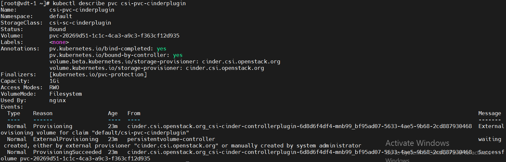
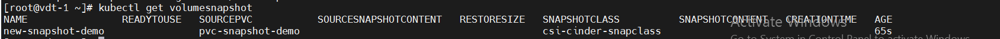
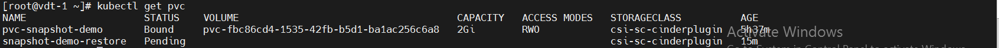
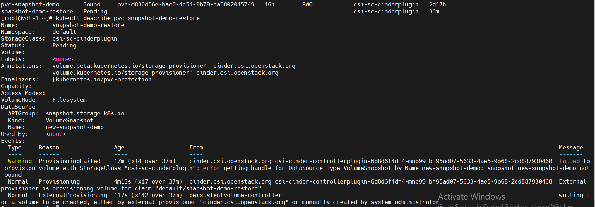

# 1. Cài đặt Cinder csi.
- Tạo các file cài đặt:

    ```
    cinder-csi-controllerplugin-rbac.yaml
    cinder-csi-controllerplugin.yaml
    cinder-csi-nodeplugin-rbac.yaml
    cinder-csi-nodeplugin.yaml
    csi-cinder-driver.yaml
    csi-secret-cinderplugin.yaml
    ```
- Lưu ý sửa phần `cloud.conf` trong file `csi-secret-cinderplugin.yaml`.

- Dùng lệnh `kubectl apply -f` để áp dụng các file đã tạo.


    

# 2. Test Dynamic Volume Provisioning

- Tạo file `nginx2.yaml` để tạo StorageClass, PersistentVolumeClaim và Pod.

- Dùng câu lệnh `kubectl -f nginx2.yaml create` để áp dụng file `nginx2.yaml`

- Đã tạo được `volume` với `StorageClass` vừa tạo.

    

- Describe `pvc`
    

# 3. Test Snapshot Create and Restore
- Trước hết ta cần cài đặt VolumeSnapshot CRDs.
    - Tạo các file:
        - snapshot.storage.k8s.io_volumesnapshotclasses.yaml
        - snapshot.storage.k8s.io_volumesnapshotcontents.yaml
        - snapshot.storage.k8s.io_volumesnapshots.yaml
    - Dùng câu lệnh `kubectl apply -f` để chạy các file.
    - Check kết quả: 


        ```
        kubectl api-resources | grep volumesnapshot
        ```
        
- Các file cần chuẩn bị: 
    - example.yaml
    - snapshotcreate.yaml
    - snapshotrestore.yaml
- Triển khai app , Tạo Storage Class, Snapshot Class và PVC
    ```
        kubectl apply -f example.yaml
    ```
- Kiểm tra trạng thái của PVC mới tạo: 
    ```
        kubectl get pvc
    ```


    

- Tạo Snapshot của PVC.
    ```
        kubectl apply -f snapshotcreate.yaml
    ```
- Kiểm tra Snapshot đã được tạo:
    ```
        kubectl get volumesnapshot
    ```

    

- Restore volume từ snapshot
    ```
        kubectl apply -f snapshotrestore.yaml
    ```
- Kiểm tra volume từ snapshot đã được tạo:
    ```
        kubectl get pvc
    ```

- Bug: 
    ```
    get pvc
    ```
    

    ```
        kubectl describe pvc snapshot-demo-restore
    ```

    

# 4. Test Using Block Volume
- Triển khai app mẫu:
    ```
        kubectl create -f block.yaml
    ```

- Check Pod:
    ```
        kubectl get pods
    ```

- Check xem node được mounted vào bên trong container chưa:

    

# 5. 
# Ref
[1] [Setup-Cinder-csi](https://github.com/kubernetes/cloud-provider-openstack/tree/master/manifests/cinder-csi-plugin)
