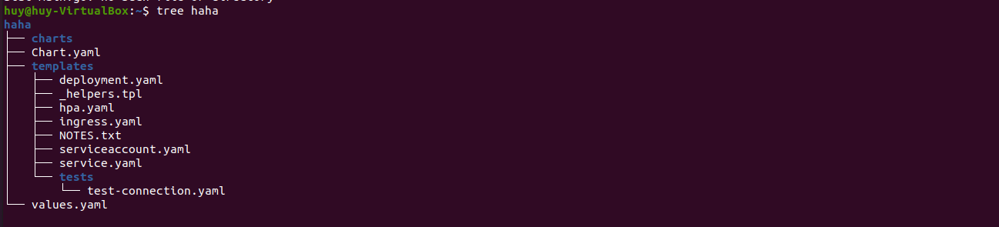
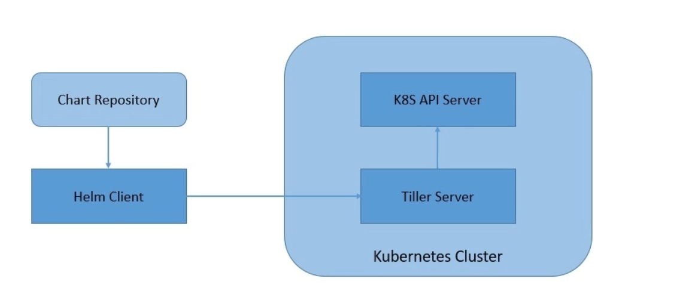

# A. Helm Chart 
## 1. Helm là gì?
- Helm là một trình quản lý gói và công cụ quản lý ứng dụng cho Kubernetes, gói nhiều tài nguyên K8s vào một đơn vị triển khai logic duy nhất được gọi là `Chart`.
- Helm là công cụ cho phép triển khai và quản lý ứng dụng trong Kubernetes dễ dàng hơn. Helm sử dụng các Chart (tập hợp các file yaml(manifest)) để triển khai ứng dụng.

## 2. Lợi ích từ Helm
- Deployment đơn giản hơn mang tính chất lặp lại với chỉ vài câu lệnh ngắn.
- Quản lý sự phụ thuộc của ứng dụng của các version cụ thể.
- Thực hiện nhiều deployment với các môi trường khác nhau như: test, staging, production, ...
- Thực thi các jobs liên quan đến chạy ứng dụng trước khi deployment.
- Dễ dàng update rollback và test deployment khi có vấn đề xảy ra hay muốn cập nhật phiên bản mới.
## 3. Concept và kiến trúc.
- 3 concept chính của Helm:
    - Chart: là một cây thông tin cần thiết để mô tả một ứng dụng chạy trên Kubernetes cluster. Tập hợp những file YAML template của những K8s resource cần thiết để dựng lên một ứng dụng Kubernetes. Để dễ hình dung thì Chart của Helm giống như Image của Docker. Chứa một file `Chart.yaml`, templates, values mặc định (`values.yaml`) và các phụ thuộc.

    

    -  Vai trò của các file:
        - charts/: những chart phụ thuộc có thể để vào đây tuy nhiên vẫn nên dùng `requirements.yaml` để link các chart phụ thuộc linh động hơn.
        - templates/: chứa những template file để khi kết hợp với các biến config tạo thành các manifest file cho K8s. 
        - Chart.yaml/: yaml file chưa thông tin liên quan đến định nghĩa chart như tên, version, ...
        - requirements.yaml/: yaml file chứa danh sách các link của Chart phụ thuộc.
        - values.yaml/: yaml file chứa các biến config mặc định cho Chart. 
    - Config: Nắm trong file `values.yaml`. Chứa các thông tin cấu hình khi kết hợp với Chart tạo thành một đối tượng có thể `release` - phát hành hay cài đặt - trên Kubernetes.
    - Release: là một "running instance" của Chart kết hợp với Config. Là tập hợp các resource được deploy trên cluster sử dụng Helm.
        - Khi một chart được cài đặt, thư viện Helm tạo một `release` để theo dõi việc cài đặt. 

- Kiến trúc: kiến trúc client-server khá đơn giản, bao gồm client CLI và một server chạy trong Kubernetes cluster:
    - Helm CLient: cung cấp cho developer sử dụng nó một command-line interface để làm việc với charts, config, release, repo. Helm Client tương tác với Tiller Server, để thực hiện các hành động khác nhau như install, upgrade và rollback với những Charts, Release.
    - Tiller Server: là một server nằm trong Kubernetes cluster, tương tác với Helm Client và giao tiếp Kubernetes API Server. Nhờ đó Helm có thể dễ dàng quản lý Kubernetes với các tác vụ như install, upgrade, query, remove đối với Kubernetes resources.

    

- Values file: cung cấp cách để ghi đè các template defaults bằng thông tin của bạn.

## 2. Các câu lệnh

- Tải repo Chart: 
    ```
        helm repo add [NAME] [URL]
    ```

    ```
        helm repo list // Liet ke danh sach repo

        helm repo update // Cap nhat cac repo

        helm search repo [NAME] // Tim kiem repo theo ten
    ```
- Cài đặt Chart:
    ```
        helm install [NAME] [CHART] [flags]
    ```
- Tạo Chart: 
    
    ```
        helm create [NAME]
    ```

- List release:
    ```
        helm list --all-namspaces
    ```
- Uninstall chart:
    ```
        helm uninstall [NAME] --namespace [NAMESPACE]
    ```

- Cập nhật release:

    ```
        helm upgrade [RELEASE] [CHART] [flags]
    ```
- Rollback:
    ```
        helm history [RELEASE]

        helm rollback [RELEASE] 1
    ```

- Helm installs charts into Kubernetes, creating a new `release` for each installation. And to find new charts, you can search Helm chart `repositories`.
# B. Task
## 1. Repo vs Release in Helm
- `Repo`: là online collection of charts. Có URL. Có thể search, download, install chart từ repo.
- `Release`:  là một "running instance" của Chart kết hợp với Config.
Khi cài đặt Chart, Helm kết hợp các template file của Chart với các config đẻ tạo các manifest file được deploy thông qua Kubernetes API. Khi đó một `Release` sẽ được tạo ra. 
- `Release` is a collection of Kubernetes resources deployed to the cluster using Helm.
## 2. 


# C. Reference
[1] [Helm Document](https://helm.sh/docs/)

