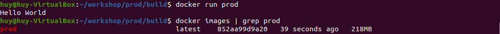
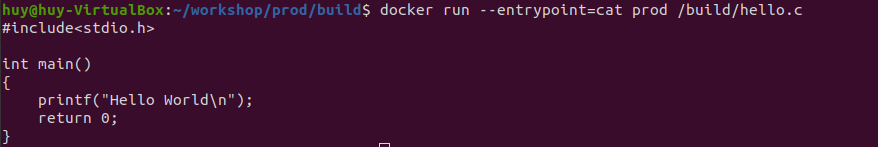
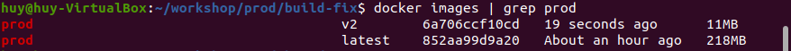
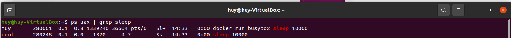
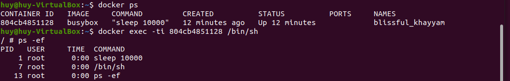
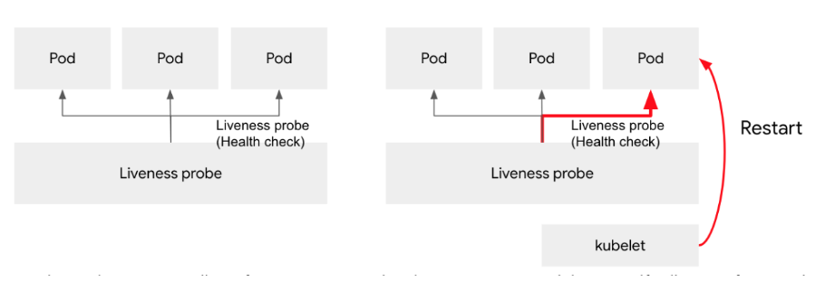
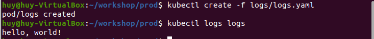
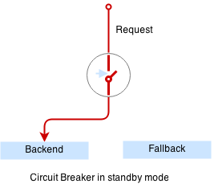
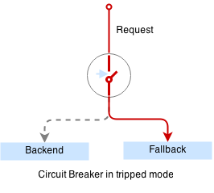

1. Gửi ace các anti pattern/production pattern( Cấu trúc) khi chạy ứng dụng trên k8s
2. https://github.com/gravitational/workshop/blob/master/k8sprod.md

1. Anti-pattern
- Các giải pháp được tái sử dụng và được cho là đem lại lợi ích và hiệu quả ở ban đầu nhưng lại dần dần có lại nhiều hơn lợi được gọi là Anti-pattern.

3. Production Environment: Đây là môi trường “thần thánh”, chứa ứng dụng thật đang chạy, với người dùng thật, dữ liệu thật. 

# A. Chúng ta sẽ khám phá các kỹ thuật hữu ích để cải thiện khả năng phục hồi và tính sẵn sàng cao của việc triển khai Kubernetes và sẽ xem xét một số lỗi phổ biến cần tránh khi làm việc với Docker và Kubernetes.

## 1.2 Anti-Pattern: Mixing Build And Runtime
- Anti-pattern phổ biến khi làm việc với Docker Images, khi viết Dockerfiles cho images là mix build và runtime environments trong cùng 1 image.
- Ví dụ: Dockerfile:

```
    FROM ubuntu:20.04

    RUN apt-get update
    RUN apt-get install -y gcc
    ADD hello.c /build/hello.c
    RUN gcc /build/hello.c -o /build/hello
    ENTRYPOINT ["/build/hello"]
```
- Biên dịch và chạy chương trình `hello world` đơn giản:

```
    $ docker build -t prod . 
    $ docker run prod
```
- `Có vấn đề với Docker image.`

    * Kích cỡ:

        

        - Mất 218 Mb để lưu trữ chương trình vài Kb!!!
        - Chúng ta đã cung cấp trình quản lý gói, trình biên dịch C và rất nhiều công cụ không cần thiết khác không cần thiết để chạy chương trình này.

    * Bảo mật
        - Chúng tôi phân phối toàn bộ chuỗi công cụ xây dựng. Ngoài ra, chúng tôi gửi mã nguồn của image:

        

### `Giải pháp: TÁCH BIỆT BUILD VÀ RUNTIME ENVIRONMENT`
- Một cách tốt hơn để làm điều này là sử dụng một mẫu có tên là "buildbox". Ý tưởng đằng sau nó là bạn xây dựng một image "builbox" riêng biệt cung cấp môi build environment cần thiết để complie/build chương trình và sử dụng một image khác, nhỏ hơn nhiều, để chạy chương trình. Container `BuildBox` có thể build, test và deploy software project, sử dụng công cụ Docker.

```
    docker build -f build.dockerfile -t buildbox .
```

--> Chúng ta có `buildbox` image bao gồm build environment. Có thể dùng nó để compile chương trình.

- Thay vì xây dựng một image khác với tệp nhị phân đã biên dịch (và mã nguồn của chương trình) bên trong nó bằng cách sử dụng `docker build`, chúng ta mount thư mục mã nguồn vào buildbox container của chúng ta, biên dịch chương trình và có vùng chứa để xuất tệp nhị phân kết quả vào cùng một ổ đĩa.

```
    #run.dockerfile
    FROM quay.io/gravitational/debian-tall:0.0.1

    ADD hello /hello
    ENTRYPOINT ["/hello"]
```
- Tiến hành build và run chương trình:
    ```
        $ docker build -f run.dockerfile -t prod:v2 .
        $ docker run prod:v2
    ```
- Kích cỡ: 
    
- 


## 1.3 Anti Pattern: Zombies And Orphans

- Để tiến trình orphaned chạy ở background.

- Chạy một container đơn giản:

    ```
        $ docker run busybox sleep 10000
    ```

- Liệt kê các process chạy nền:
 
    
 
 --> Có 2 tiến trình `docker run` và `sleep 10000` đang chạy trong container

- Thực hiện kill `docker run`
    ```
        $ kill 14171
    ```

Tuy nhiên tiến trình `docker run` không thoát và tiến trình `sleep` vẫn đang chạy!

- Lí do:

- Truy cập vào container và xem xét:
    

lệnh `sleep` đang chạy dưới dạng PID 1 và vì nó không explicitly register bất cứ signal handlers nào, nên tín hiệu TERM của chúng tôi bị bỏ qua.

- Tiến hành loại bỏ container:
    ```
        docker kill []
    ```

` Giải pháp`: Chúng ta cần một simple init system có bộ xử lý tín hiệu được chỉ định.
Các kỹ sư Yelp xây dựng a simple and lightweight init system, `dumb-init`:

```
    $ docker run quay.io/gravitational/debian-tall /usr/bin/dumb-init /bin/sh -c "sleep 10000"
```

## 1.4 Anti Pattern: Direct Use Of Pods

- Kubernetes Pod là một khối xây dựng mà bản thân nó không cung cấp bất kỳ sự đảm bảo nào về độ bền. Như các tài liệu của Kubernetes nói, một pod sẽ không thể tồn tại khi bị lỗi lập lịch, lỗi node hoặc các trường hợp bị trục xuất khác, chẳng hạn như do thiếu tài nguyên.
 
- Nó cũng sẽ khởi động lại trong trường hợp vùng chứa của nó gặp sự cố, miễn là nó có policy khởi động lại thích hợp.
- Tuy nhiên, trong trường hợp một node gặp sự cố hoặc bắt đầu hết tài nguyên dẫn đến việc trục xuất, pod sẽ bị mất.

--> Không nên sử dụng pod trực tiếp trong production.

`Giải Pháp`: Nên sử dụng controllers cung cấp khả năng tự phục hồi trên phạm vi cluster - có nhiều lựa chọn (Deployments, ReplicaSets, DaemonSets, StatefulSets, ...).

- Khi xóa pod thì nó sẽ lập lịch lại.

## 1.5 Anti Pattern: Using Background Processes

- `Tình huống`: Khi chạy một Web server bên trong 1 container. Trường hợp Web server bị lỗi không chạy được nhưng container vẫn chạy.
- `Giải pháp`: Sử dụng Liveness Probes. Liveness probe kiểm tra sức khỏe của container như mình đã nói, và nếu vì lý do nào đó, Liveness probe không thành công, nó sẽ khởi động lại container.



## 1.6 Production Pattern: Logging
- Khi định cấu hình logging cho ứng dụng đang chạy bên trong container, cần đảm bảo logs chuyển đến đầu ra tiêu chuẩn:
    
    

- Kubernetes và Docker có một hệ thống các plugin để đảm bảo logs được gửi đến `stdout` và `stderr` sẽ được thu thập, chuyển tiếp và xoay vòng.

## 1.7 Production Pattern: Immutable Containers

- Mỗi khi bạn ghi nội dung nào đó vào hệ thống tệp của vùng chứa, nó sẽ kích hoạt `copy-on-write strategy`. Cách tiếp cận này làm cho các container hiệu quả.
- Cách thức hoạt động: tất cả các layer trong 1 Docker image là read-only. Khi một container bắt đầu, một lớp mỏng có thể ghi được thêm vào bên trên các lớp read-only khác của nó. Bất kỳ sự thay đổi nào mà container thực hiện đối với filesystem đều được lưu lại ở đây và các file không thay đổi sẽ kh được sao chép vào layer ghi, điều này làm nó nhỏ nhất có thể.
- Khi một file trong container bị thay đổi, driver lưu trữ 


## 1.8 Anti-Pattern: Using `latest` Tag

- Không nên dùng tag `latest` trong production vì nó gây ra sự mơ hồ, không rõ đây là phiên bản thwujc của ứng dụng.

- Có thể sử dụng `latest`trong quá trình phát triển nhưng phải set `imagePullPolicy` là `Always` để đảm bảo Kubernetes sẽ pull phiên bản mới nhất khi tạo pod:

```
apiVersion: v1
kind: Pod
metadata:
  name: always
  namespace: default
spec:
  containers:
  - command: ['/bin/sh', '-c', "echo hello, world!"]
    image: busybox:latest
    name: server
    imagePullPolicy: Always
```

## 1.9 Production Pattern: Pod Readiness
- Hãy để tưởng tượng rằng ứng dụng của bạn mất một phút để warm up và start.
- Dịch vụ của bạn sẽ không hoạt động cho đến khi nó up và running, mặc dù process đã hoặt động. Nghĩa là mặc dù thấy đã chạy rồi nhưng thực tế là hoạt động chưa OK. Hoặc bạn cũng gặp vấn đề khi scale up deployment để có thêm nhiều bản sao. một Pod (bảo sao) mới không nên nhận traffic cho đến khi nó thật sự sẵn sàng, nhưng theo mặc định thì Kubernetes sẽ gửi traffic ngay khi container starts.
- Bằng cách sử dụng readiness probe, Kubernetes sẽ đợi cho đến khi ứng dụng được khởi động hoàn toàn (ở trạng thái có thể nhận traffic) trước khi cho phép service gửi traffic đến Pod mới.

https://blog.vietnamlab.vn/kubernetes-best-practice-p2-application-process-management-with-poststart-and-prestop-hook/
## 1.10 Anti-Pattern: Unbound Quickly Failing Jobs
- Kubernetes cung cấp công cụ hữu ích mới để lập lịch các vùng chứa thực hiện tác vụ một lần: jobs (https://kubernetes.io/docs/concepts/workloads/controllers/job/)
- Tuy nhiên, có vấn đề ở đây: 
```
apiVersion: batch/v1
kind: Job
metadata:
  name: bad
spec:
  template:
    metadata:
      name: bad
    spec:
      restartPolicy: Never
      containers:
      - name: box
        image: busybox
        command: ["/bin/sh", "-c", "exit 1"]
```
```
$ cd prod/jobs
$ kubectl create -f bad.yaml
```
- Ta sẽ quan sát việc tạo ra hàng trăm container cho công việc thử lại mãi mãi:
```
$ kubectl describe jobs 
Name:		bad
Namespace:	default
Image(s):	busybox
Selector:	controller-uid=18a6678e-11d1-11e7-8169-525400c83acf
Parallelism:	1
Completions:	1
Start Time:	Sat, 25 Mar 2017 20:05:41 -0700
Labels:		controller-uid=18a6678e-11d1-11e7-8169-525400c83acf
		job-name=bad
Pods Statuses:	1 Running / 0 Succeeded / 24 Failed
No volumes.
Events:
  FirstSeen	LastSeen	Count	From			SubObjectPath	Type		Reason			Message
  ---------	--------	-----	----			-------------	--------	------			-------
  1m		1m		1	{job-controller }			Normal		SuccessfulCreate	Created pod: bad-fws8g
  1m		1m		1	{job-controller }			Normal		SuccessfulCreate	Created pod: bad-321pk
  1m		1m		1	{job-controller }			Normal		SuccessfulCreate	Created pod: bad-2pxq1
  1m		1m		1	{job-controller }			Normal		SuccessfulCreate	Created pod: bad-kl2tj
  1m		1m		1	{job-controller }			Normal		SuccessfulCreate	Created pod: bad-wfw8q
  1m		1m		1	{job-controller }			Normal		SuccessfulCreate	Created pod: bad-lz0hq
  1m		1m		1	{job-controller }			Normal		SuccessfulCreate	Created pod: bad-0dck0
  1m		1m		1	{job-controller }			Normal		SuccessfulCreate	Created pod: bad-0lm8k
  1m		1m		1	{job-controller }			Normal		SuccessfulCreate	Created pod: bad-q6ctf
  1m		1s		16	{job-controller }			Normal		SuccessfulCreate	(events with common reason combined)
```
- Theo thời gian, các lob sẽ tích lũy và tải trên các nodes và Docker sẽ khá lớn, đặc biệt nếu lob fail nhanh.
- `Giải Phaps`: sử dụng `activeDeadlineSeconds` để giới hạn việc thử lại:
```
apiVersion: batch/v1
kind: Job
metadata:
  name: bound
spec:
  activeDeadlineSeconds: 30
  template:
    metadata:
      name: bound
    spec:
      restartPolicy: Never
      containers:
      - name: box
        image: busybox
        command: ["/bin/sh", "-c", "exit 1"]
```
- Sau 30 giây, job fail và không có pod nào được tạo mới nữa.

## 1.11 Production Pattern: Pod Quotas
- Một trong những tính năng quan trọng của Kubernetes là quản lý tài nguyên. Kubernetes cho phép bạn định cấu hình hạn ngạch tài nguyên CPU / RAM cho các vùng chứa để đảm bảo rằng không một vùng chứa nào có thể strarve toàn bộ hệ thống.

- Giả sử chúng ta có một vùng chứa có xu hướng làm mất bộ nhớ:
```
    $ cd prod/quotas
    $ docker build -t $registry:5000/memhog:0.0.1 .
    $ docker push $registry:5000/memhog:0.0.1
    $ kubectl create -f quota.yaml
```

- Vùng chứa tiêu thụ khoảng 100 megabyte bộ nhớ nhưng giới hạn chúng tôi đặt trên pod của mình chỉ cho phép 20. Hãy xem Kubernetes đã xử lý nó như thế nào:
```
$ kubectl get pods/quota
quota                       0/1     OOMKilled          1          4s
```
- OOM killer của Kubernetes đã loại bỏ container, vì vậy nếu ứng dụng chạy bên trong nó làm rò rỉ bộ nhớ dần dần, nó sẽ khởi động lại.

- Kubernetes cũng cho phép bạn định cấu hình hạn ngạch cho mỗi namespace và sử dụng thuật toán lập lịch thông minh để đảm bảo rằng các pod được phân phối trên các cluster node một cách thích hợp. Ví dụ, nó sẽ không lên lịch một pod trên một node nếu yêu cầu hạn ngạch của pod đó vượt quá tài nguyên có sẵn trên node.

## 1.12 Anti-Pattern: Putting Configuration Inside Image

- Thường thì mỗi application cần một file config để chạy.
- Khi đặt file config và chương trình trong cùng một container gây ra một số hạn chế. Ví dụ như khi muốn update file config trong khi container đang chạy.

- ` Giải Pháp:` Kubernetes cung cấp cách giải quyết bằng sử dụng `ConfigMaps`.
-  ConfigMap là một tài nguyên của K8s có thể được mount vào một container đang chạy. 
- Tạo một ConfigMap từ config file:
```
    $ kubectl create configmap config --from-file=config.yaml
$ kubectl get configmaps/config -oyaml
```

- Chúng ta có thể thấy Kubernetes chuyển config file vào 1 ConfigMap. Bây giờ chúng ta rebuild image để xóa tệp cấu hình  và cập nhật pod để sử dụng ConfigMap:
```
$ docker build -t $registry:5000/config:0.0.1 -f config-fix.dockerfile .
$ docker push $registry:5000/config:0.0.1
$ kubectl delete -f pod.yaml
$ kubectl create -f pod-fix.yaml
```
## 1.13 Production Pattern: Circuit Breaker

- Circuit Breaker là một phần mềm trung gian đặc biệt được thiết kế để cung cấp một hành động dự phòng trong trường hợp nếu dịch vụ đã xuống cấp. Sẽ rất hữu ích để ngăn chặn các lỗi xếp tầng - trong đó sự thất bại của một dịch vụ này dẫn đến sự thất bại của một dịch vụ khác. Circuit Breaker quan sát số liệu thống kê yêu cầu và kiểm tra số liệu thống kê đối với tình trạng lỗi đặc biệt.





- Trong trường hợp nếu điều kiện phù hợp, CB sẽ kích hoạt kịch bản dự phòng: trả về mã phản hồi hoặc chuyển hướng yêu cầu đến giao diện người dùng khác.

## 1.14 Production Pattern: Sidecar For Rate And Connection Limiting
- Một sidecar là một container được sắp xếp theo vị trí với các container khác trong cùng một pod, bổ sung thêm logic cho service, chẳng hạn như phát hiện lỗi, kết thúc TLS và các tính năng khác.

- Dưới đây là một ví dụ về proxy nginx sidecar bổ sung giới hạn tốc độ và kết nối:
```
$ cd prod/sidecar
$ docker build -t $registry:5000/sidecar:0.0.1 -f sidecar.dockerfile .
$ docker push $registry:5000/sidecar:0.0.1
$ docker build -t $registry:5000/service:0.0.1 -f service.dockerfile .
$ docker push $registry:5000/service:0.0.1
$ kubectl apply -f sidecar.yaml
deployment "sidecar" configured
```
- Cố gắng truy cập dịch vụ nhanh hơn một yêu cầu mỗi giây và bạn sẽ thấy tốc độ giới hạn trong hành động:

```
$ kubectl run -ti --rm cli --image=appropriate/curl --restart=Never --command /bin/sh
$ curl http://sidecar
```

