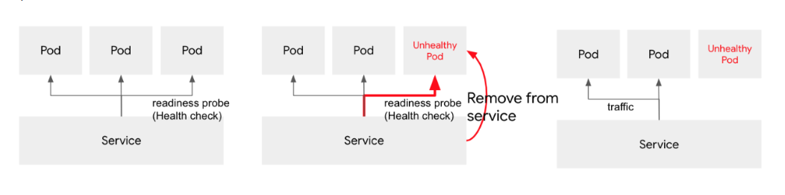

1. Gửi ace các anti pattern/production pattern( Cấu trúc) khi chạy ứng dụng trên k8s
2. https://github.com/gravitational/workshop/blob/master/k8sprod.md

# Tìm hiểu các kỹ thuật hữu ích để cải thiện resiliency và HA của việc triển khai Kubernetes và đưa ra một số lỗi phổ biến cần tránh khi làm việc với Docker và Kubernetes.

## AAnti-Pattern

### 1 Anti-Pattern: Mixing Build And Runtime

- Anti-pattern phổ biến khi làm việc với Docker Images: viết build và runtime trong cùng một image.

- Ví dụ Dockerfile để build và run code hello world:

```
    FROM ubuntu:20.04

    RUN apt-get update
    RUN apt-get install -y gcc
    ADD hello.c /build/hello.c
    RUN gcc /build/hello.c -o /build/hello
    ENTRYPOINT ["/build/hello"]
```
- Sau khi build và run code chỉ ra 2 vấn đề: 
    * Size:

        

        - Tốn quá nhiều dung lượng lưu trữ khi chạy code.
    * Security
        - Có thể lấy ra source code của image:
        

#### `Giải pháp: TÁCH BIỆT BUILD VÀ RUNTIME ENVIRONMENT`
- Sử dụng image "buildbox" để compile code. 
- Ý tưởng: xây dựng một image "builbox" để build environment cần thiết để compile/build code và sử dụng một image khác để chạy code. 
- Docker có hỗ trợ multi-stage builds. Với tính năng này, chúng ta có thể viết nhiều `stages` trong 1 Dockerfile, mỗi stage bắt đầu bằng lệnh `FROM`, có thể copy artifact từ stage này qua stage kia.

- Dockerfile với 2 stage là Build và Run:
```
#
# Build stage.
#
FROM ubuntu:18.04

RUN apt-get update
RUN apt-get install -y gcc
ADD hello.c /build/hello.c
RUN gcc /build/hello.c -o /build/hello

#
# Run stage.
#
FROM quay.io/gravitational/debian-tall:0.0.1

COPY --from=0 /build/hello /hello
ENTRYPOINT ["/hello"]
```
- Tiến hành build và run:
    ```
        $ docker build -f run.dockerfile -t prod:v2 .
        $ docker run prod:v2
    ```
- Kết quả size image: 
    

### 2. Anti Pattern: Zombies And Orphans
- Zombies: process đã hoàn thành công việc nhưng vẫn xuất hiện trong process table. 
- Orphans: process cha đã chết nhưng process con vẫn chạy.
- Bài toán:
    - chạy 1 container: 
    ```
        docker run busybox sleep 10000
    ```
    - Các process đang chạy:
        
    
    - Gửi tín hiệu kill `docker run`
    - Bên trong container:
        
    - Không kill được
    - Lí do: Linux kernel sử dụng signal handling cho các quy trình chạy với PID 1. Khi process được gửi 1 tín hiệu, kernel sẽ kiểm tra liệu có quyền handle process đã được register cho tín hiệu đó hay không, và nếu không thì sẽ fall back to default behavior. Nếu như process nhận tín hiệu có PID 1 và nó chưa đăng ký handle cho tín hiệu thì kernel sẽ không fall back default behavior, không có gì xảy ra. 
    - Ở đây, process `sleep 10000` đang chạy với PID là 1 và tín hiệu chưa được register cho process này nên khi gửi SIGTERM sẽ không có gì xảy ra. (SIGTERM được coi là hình thức "soft kill" vì khi tiến trình nhận được SIGTERM thì tiến trình đó được phép bỏ qua) 

- ` Giải pháp`: Chúng ta cần một init system có bộ xử lý tín hiệu đã register. Yelp đã xây dựng một init system `dumb-init` để giải quyết vấn đề:

```
    $ docker run quay.io/gravitational/debian-tall /usr/bin/dumb-init /bin/sh -c "sleep 10000"
```
- `dumb-init` is a simple process supervisor and init system designed to run as PID 1 inside Docker.

  [About dumb-init](https://github.com/Yelp/dumb-init)
### 3 Anti-Pattern: Direct Use Of Pods

- Pod là thành phần cơ bản nhất trong một hệ thống Kubernetes, không bền vững. 

--> Không nên sử dụng pod trực tiếp trong production. 

- `Giải Pháp`: Nên sử dụng controllers cung cấp khả năng tự phục hồi (ví dụ: Deployments, ReplicaSets, DaemonSets, StatefulSets, ...).
- Ví dụ sử dụng ReplicaSets (là một controller đảm bảo sự ổn định cho các nhân bản khi đang chạy): khi xóa 1 Pod thì sẽ có 1 pod khác thay thế. 
### 4 Anti-Pattern: Using Background Processes

- `Tình huống`: Khi chạy một Web server bên trong 1 container. Trường hợp Web server bị lỗi không chạy được nhưng container vẫn chạy.
- `Giải pháp`: Sử dụng Liveness Probes. Liveness probe kiểm tra của container có hoạt động tốt hay không, và nếu Liveness probe fail, tiến hành restart container.


### 5 Anti-Pattern: Using `latest` Tag

- Không nên dùng tag `latest` trong production vì nó không chỉ rõ version của application là version nào. 

- Khi sử dụng sử dụng thẻ `latest`trong dev thì cần set `imagePullPolicy` là `Always` để đảm bảo Kubernetes sẽ pull phiên bản mới nhất khi tạo pod:
- Ví dụ:
```
apiVersion: v1
kind: Pod
metadata:
  name: always
  namespace: default
spec:
  containers:
  - command: ['/bin/sh', '-c', "echo hello, world!"]
    image: busybox:latest
    name: server
    imagePullPolicy: Always
```
### 6 Anti-Pattern: Unbound Quickly Failing Jobs
- Kubernetes cung cấp công cụ để lập lịch các container thực hiện tác vụ một lần (one-time task): `jobs` (https://kubernetes.io/docs/concepts/workloads/controllers/job/)
- Jobs có chức năng tạo POD đảm bảo nó chạy và kết thúc thành công. Cho đến khi các pod hoàn thành thì Job kết thúc.
- Bài toán: nếu như việc tạo pod lỗi liên tục thì job chạy liên tục. 
- Ví dụ: 
```
apiVersion: batch/v1
kind: Job
metadata:
  name: bad
spec:
  template:
    metadata:
      name: bad
    spec:
      restartPolicy: Never
      containers:
      - name: box
        image: busybox
        command: ["/bin/sh", "-c", "exit 1"]
```
```
$ cd prod/jobs
$ kubectl create -f bad.yaml
```
- `Giải Pháp`: sử dụng `activeDeadlineSeconds` để giới hạn việc chạy lại job:
- Ví dụ:
```
apiVersion: batch/v1
kind: Job
metadata:
  name: bound
spec:
  activeDeadlineSeconds: 30
  template:
    metadata:
      name: bound
    spec:
      restartPolicy: Never
      containers:
      - name: box
        image: busybox
        command: ["/bin/sh", "-c", "exit 1"]
```
- Sau 30 giây, nếu Job vẫn fail thì sẽ dừng hẳn.

### 7 Anti-Pattern: Putting Configuration Inside Image
- Mỗi application cần một file config để chạy.
- Khi đặt file config và chương trình trong cùng một container gây ra một số hạn chế. Ví dụ như sẽ khó để update file config trong khi container đang chạy.
- ` Giải Pháp:` Kubernetes cung cấp cách giải quyết bằng sử dụng `ConfigMaps`. ConfigMap là một Kubernetes API Object có thể được sử dụng để lưu trữ dữ liệu dưới dạng cặp key-value.
- ConfigMaps cung cấp khả năng làm cho các ứng dụng linh động bằng cách tách các cấu hình dành riêng cho môi trường khỏi các containers.
- Ví dụ 1 ConfigMap:
```
kind: ConfigMap
apiVersion: v1
metadata:
  name: example-configmap
  namespace: default
data:
  # Configuration Values are stored as key-value pairs
  system.data.name: "app-name"
  system.data.url: "https://app-name.com"
  system.data.type_one: "app-type-xxx"
  system.data.value: "3"
  # File like Keys
  system.interface.properties: |
    ui.type=2
    ui.color1=red
    ui.color2=green
```
## 2.Production Pattern

### 1 Production Pattern: Logging
- Khi định cấu hình logging cho ứng dụng đang chạy bên trong container, cần đảm bảo bắn ra logs:
    
    

- Kubernetes và Docker có một hệ thống các plugin để đảm bảo logs được gửi đến `stdout` và `stderr`.
- `stderr`: xuất lỗi trong quá trình chạy lệnh ra màn hình.
- `stdout`: xuất kết quả các lệnh terminal ra màn hình. 

### 2 Production Pattern: Pod Readiness
- Ứng dụng mất một thời gian để warm up và start.
- Service sẽ không hoạt động cho đến khi nó up và running, mặc dù process đã hoạt động. Mặc dù thấy đã chạy rồi nhưng thực tế là hoạt động chưa OK.
- Bằng cách sử dụng readiness probe, Kubernetes sẽ đợi cho đến khi ứng dụng được khởi động hoàn toàn (ở trạng thái có thể nhận traffic) trước khi cho phép service gửi traffic đến Pod mới.




### 3 Production Pattern: Pod Quotas 
- Một trong những tính năng quan trọng của Kubernetes là quản lý tài nguyên. 
- Kubernetes cho phép giới hạn CPU/RAM trên mỗi container.
- Nếu như 1 container tiêu thụ bộ nhớ vượt quá giới hạn cung cấp thì OOM (out of memory) killer sẽ loại bỏ container đó.
- Kubernetes cho phép config giới hạn CPU/RAM cho mỗi namspace và sử dụng thuật toán lập lịch để đảm bảo các pod được phân phối trên các node thích hợp. Ví dụ nó sẽ khoogn lên lịch cho pod trong node nếu như yêu cầu về CPU/RAM của pod đó vượt quá tài nguyên có sẵn trên node. 

### 4 Production Pattern: Circuit Breaker

- Circuit breaker is a special middleware that is designed to provide a fail-over action in case the service has degraded. It is very helpful to prevent cascading failures - where the failure of the one service leads to failure of another. Circuit breaker observes requests statistics and checks the stats against a special error condition.


In case if condition matches, CB activates the fallback scenario: returns the response code or redirects the request to another frontend.


