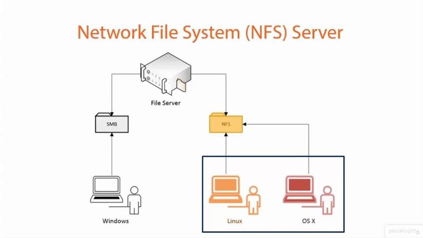
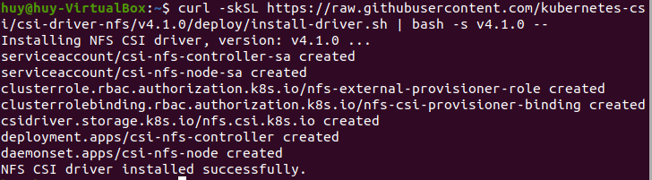
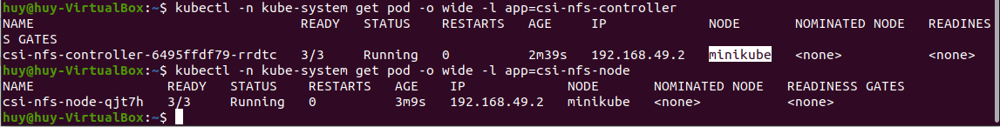

# 4.  Dựng NFS server ở local, cài minikube, cài nfs csi https://github.com/kubernetes-csi/csi-driver-nfs test thử các action

## 4.1. NFS là gì?
- NFS (Network File System) là một hệ thống giao thức chia sẻ file phát triển bởi Sun Microsystems từ năm 1984, cho phép người dùng trên một máy tính khách truy cập tới hệ thống file chia sẻ thông qua một mạng máy tính giống như truy cập trực tiếp trên ổ cứng.

    

- Các tính năng của NFS: 
    - NFS cho phép truy cập cục bộ đến các tệp từ xa, cho phép nhiều máy tính sử dụng cùng một tệp để mọi người trên mạng có thể truy cập vào cùng một dữ liệu
    - Với sự trợ giúp của NFS, chúng ta có thể cấu hình các giải pháp lưu trữ tập trung.
    - Giảm chi phí lưu trữ bằng cách để các máy tính chia sẻ ứng dụng thay vì cần dung lượng ổ đĩa cục bộ cho mỗi ứng dụng của người dùng
    - Giảm chi phí quản lý hệ thống và minh bạch hệ thống tập tin
    - Cung cấp tính nhất quán và độ tin cậy của dữ liệu vì tất cả người dùng đều có thể đọc cùng một bộ tệp
    - Có thể bảo mật với Firewalls và Kerberos

## 4.2. Triển khai NFS server trên K8s.
- Ở Lab này em sử dụng máy ảo Ubuntu 20.04 đã được cài đặt `minikube` và `kubectl`

## 1. Install NFS CSI Driver v4.1.0 version on Kubernetes cluster
- Tạo các file: 
    - rbac-csi-nfs.yaml
    - csi-nfs-driverinfo.yaml
    - csi-nfs-controller.yaml
    - csi-nfs-node.yaml
- Apply các file đã tạo bằng câu lệnh:

    ```
    kubectl apply -f 
    ```
- Hoặc có thể sử dụng câu lệnh:
    ```
    curl -skSL https://raw.githubusercontent.com/kubernetes-csi/csi-driver-nfs/v4.1.0/deploy/install-driver.sh | bash -s v4.1.0 --
    ```



- check pods status:

    ```
    kubectl -n kube-system get pod -o wide -l app=csi-nfs-controller
    kubectl -n kube-system get pod -o wide -l app=csi-nfs-node
    ```
- Example output:

    

## 2. Set up a NFS Server on a Kubernetes cluster

- Tạo file `nfs-server.yaml`
- Apply file bằng câu lệnh:
    ```
    kubectl apply -f nfs-server.yaml
    ```

--> service `nfs-server` được tạo.

## Storage Class Usage (Dynamic Provisioning)
### 3. Create a Storage Class

- tạo file `nfs-sc.yaml`
```
apiVersion: storage.k8s.io/v1
kind: StorageClass
metadata:
  name: nfs-csi
provisioner: nfs.csi.k8s.io
parameters:
  server: nfs-server.default.svc.cluster.local
  share: /
  # csi.storage.k8s.io/provisioner-secret is only needed for providing mountOptions in DeleteVolume
  # csi.storage.k8s.io/provisioner-secret-name: "mount-options"
  # csi.storage.k8s.io/provisioner-secret-namespace: "default"
reclaimPolicy: Delete
volumeBindingMode: Immediate
mountOptions:
  - nconnect=8  # only supported on linux kernel version >= 5.3
  - nfsvers=4.1
```

- Apply file:
    ```
    kubectl apply -f nfs-sc.yaml
    ```
### 4: Tạo PVC
``` 
    kubectl create -f https://raw.githubusercontent.com/kubernetes-csi/csi-driver-nfs/master/deploy/example/pvc-nfs-csi-dynamic.yaml
```

## PV/PVC Usage (Static Provisioning)

- Tạo PV
    ```
    kubectl create -f https://raw.githubusercontent.com/kubernetes-csi/csi-driver-nfs/master/deploy/example/pv-nfs-csi.yaml
    ```
- Tạo PVC
    ```
    kubectl create -f https://raw.githubusercontent.com/kubernetes-csi/csi-driver-nfs/master/deploy/example/pvc-nfs-csi-static.yaml
    ```

- Tạo a deployment
    ```
    kubectl create -f https://raw.githubusercontent.com/kubernetes-csi/csi-driver-nfs/master/deploy/example/deployment.yaml
    ```
