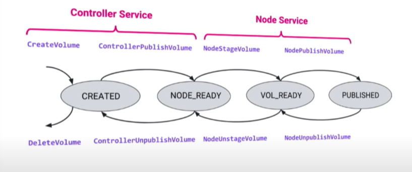

# 1. Làm rõ Volume Lifecycle:  Các volume ở mỗi state đang ở trạng thái như nào, state thể hiện ở đâu


 


- ``Controller Service``: Kiểm soát và quản lí volume như: tạo, xóa, attach/detach, snapshot, ...
- ``Node Service``: Kiểm soát hành động của volume trong node như: mount, unmount, ... 

- Ban đầu khi volume chưa được tạo. CO sẽ thực hiện cấp phát volume bằng `CreateVolume` trong `Controller Service`. 

Nếu tạo thành công thì Plugin sẽ phản hồi `0 OK` với `CreateVOlumeResponse` tương ứng.

    --> volume sẽ ở trạng thái Created.

- `ControllerPublishVolume`: attach volume vừa được tạo vào `node` cụ thể.

Nếu attach thành công thì Plugin sẽ phản hồi `0 OK` với 
`ControllerPublishVolumeResponse`. 

    --> volume ở trạng thái Node_Ready

- `NodeStageVolume`: mount volume vào `staging path` (thường là global directory trong node). 

Nếu mount thành công thì Plugin sẽ phản hồi `0 OK` với `NodeStageVolumeResponse`. 

    --> trạng thái: Volume_Ready

- `NodePublishVolume`: bind mount volume từ staging path đến target path.

Nếu mount thành công thì Plugin sẽ phản hồi `0 OK` với `NodePublishVolumeResponse`.

    --> trạng thái: Published. Volume sẵn sàng được sử dụng bởi các container đag chạy trong Pod.

`Bind Mount`: gắn đường dẫn vào một đường dẫn khác. 

- `NodeUnpublishVolume`: unmount volume khỏi `target path`. Xóa bind mount từ container folder.

Nếu unmount thành công thì Plugin sẽ phản hồi `0 OK` với `NodeUnpublishVolumeResponse`.

- `NodeUnstageVolume`: unmount volume khỏi `staging path`. PVC được cập nhật và sẵn sàng cho pod khác sử dụng.

Nếu unmount thành công thì Plugin sẽ phản hồi `0 OK` với `NodeUnstageVolumeResponse`.

- `ControllerUnpublishVolume`: detach volume ra khỏi node.

Nếu detach thành công thì Plugin sẽ phản hồi `0 OK` với `ControllerUnpublishVolumeResponse`.

- `DeleteVolume`: xóa volume.

Nếu delete thành công thì Plugin sẽ phản hồi `0 OK` với `DeleteVolumeResponse`.

# 2. Các hành động tổi thiểu cần implement khi viết CSI Driver
- Bước đầu tiên để tạo một CSI Driver là viết một ứng dụng triển khai các dịch vụ gRPC được làm rõ ở `phần 5`
- Tối thiểu, CSI Driver phải thực hiện các dịch vụ CSI sau đây:
  - CSI `Identity` service: cho phép người gọi (các thành phần của K8s và vùng chứa CSI sidecar) xác định driver và chức năng tùy chọn mà nó hỗ trợ.
  - CSI `Node` service: 
    - `NodePublishVolume`, `NodeUnpublishVolume`, `NodeGetCapabilities` là bắt buộc.
    - Các phương thức bắt buộc cho phép người gọi làm một volume có sẵn trong một đường dẫn cụ thể và biết được chức năng nào driver hỗ trợ.
- Tất cả các dịch vụ CSI có thể được triển khai trong cùng một ứng dụng CSI driver. Ứng dụng CSI driver nên được đóng gói để dễ triển khai trong K8s. Sau khi được đóng gói, CSI driver có thể được ghép nối với CSI `Sidecar Container` và được triển khai ở chế độ node hoặc controller.  


## ``Trả lời câu hỏi: Tại sao sử dụng gRPC mà không phải REST API?`` 

Lí do gRPC sử dụng binary trong đóng gói dữ liệu để truyền thông (protobuf), còn Restf thì tự do, bạn tự chọn (thường là text-based: xml hoặc json).

Nên gRPC thường có tốc độ cao và độ trễ thấp hơn. 

## ``Sidecar Container là gì ``

Sidecar container: là một container riêng biệt chạy cùng với container chính. Hai container chia sẻ tài nguyên như lưu trữ pod và giao diện mạng. Sidecar container cho phép bạn nâng cao và mở rộng các chức năng của vùng chứa chính mà không cần phải sửa đổi cơ sở mã của nó. Ngoài ra, ứng dụng sidecar container có thể được phát triển bằng ngôn ngữ khác với ngôn ngữ của container chính, giúp tăng tính linh hoạt.

Trong K8s, các sidecar container bao gồm một driver registrar, external attacher, external provisioner và external snapshotter.
# 3. Cách implemment Driver
# 5. Làm rõ từng chức năng của từng CSI service
## 5.1 Controller Service : Quản lý và điều khiển volumes: tạo, xóa, attach/detach, snapshot, ...
```
service Controller {
  rpc CreateVolume (CreateVolumeRequest)
    returns (CreateVolumeResponse) {}

  rpc DeleteVolume (DeleteVolumeRequest)
    returns (DeleteVolumeResponse) {}

  rpc ControllerPublishVolume (ControllerPublishVolumeRequest)
    returns (ControllerPublishVolumeResponse) {}

  rpc ControllerUnpublishVolume (ControllerUnpublishVolumeRequest)
    returns (ControllerUnpublishVolumeResponse) {}

  rpc ValidateVolumeCapabilities (ValidateVolumeCapabilitiesRequest)
    returns (ValidateVolumeCapabilitiesResponse) {}

  rpc ListVolumes (ListVolumesRequest)
    returns (ListVolumesResponse) {}

  rpc GetCapacity (GetCapacityRequest)
    returns (GetCapacityResponse) {}

  rpc ControllerGetCapabilities (ControllerGetCapabilitiesRequest)
    returns (ControllerGetCapabilitiesResponse) {}

  rpc CreateSnapshot (CreateSnapshotRequest)
    returns (CreateSnapshotResponse) {}

  rpc DeleteSnapshot (DeleteSnapshotRequest)
    returns (DeleteSnapshotResponse) {}

  rpc ListSnapshots (ListSnapshotsRequest)
    returns (ListSnapshotsResponse) {}

  rpc ControllerExpandVolume (ControllerExpandVolumeRequest)
    returns (ControllerExpandVolumeResponse) {}

  rpc ControllerGetVolume (ControllerGetVolumeRequest)
    returns (ControllerGetVolumeResponse) {
        option (alpha_method) = true;
    }
}
``` 

- CreateVolume: cấp phát Volume. 
    - Plugin có thể tạo 3 loại volume:
        - Volume trống. Khi plugin hỗ trợ khả năng tùy chọn CREATE_DELETE_VOLUME.
        - Từ một snapshot hiện có. Khi plugin hỗ trợ khả năng tùy chọn CREATE_DELETE_VOLUME và CREATE_DELETE_SNAPSHOT.
        - Từ một volume hiện có. Khi plugin hỗ trợ clone và báo cáo khả năng tùy chọn CREATE_DELETE_VOLUME và CLONE_VOLUME.
- DeleteVolume: xóa volume đã được cấp phát bởi `CreateVolume`.
- ListVolumes: Plugin trả về thông tin các volume.
- ControllerPublishVolume: Phương thức này được sử dụng để cung cấp một volume có sẵn trên một số node bắt buộc. Attach volume được tạo vào một node cụ thể.
- ControllerUnpublishVolume: Phương thức này ngược với `ControllerPublishVolume`. Nó làm một volume không có sẵn trong node cụ thể. Detach volume khỏi node cụ thể. Sau khi detach, vlume có thể được publish tới một node khác.
- ValidateVolumeCapabilities: phương thức được sử dụng để trả về các khả năng, tính năng của volume. CO gọi phương thức này để đảm bảo rằng volume được cung cấp có các khả năng mà họ muốn. 
- GetCapacity: Phương thức này trả về dung lượng của tổng dung lượng lưu trữ có sẵn. Phương thức này cần trong trường hợp bạn có dung lượng lưu trữ hạn chế. Giả sử bạn biết rằng bạn chỉ có thể cung cấp 1TB dung lượng lưu trữ. Khi bạn cung cấp và tạo volume mới, bạn nên phản ánh nó và trả lại bộ nhớ khả dụng còn lại.
- CreateSnapshot: CO gọi thương thức này để tạo snapshot từ một volume nguồn. Snapshot này có thể được sử dụng để cấp phát một volume mới. 
- DeleteSnapshot: CO gọi phương thức này để xóa một snapshot.
- ListSnapshots: Plugin sẽ trả về thông tin về tất cả các Snapshot trên hệ thống lưu trữ trong các tham số đã cho bất kể chúng được tạo như thế nào. 
- ControllerGetCapabilities: Phương thức này cho phép CO kiểm tra các khả năng được hỗ trợ của dịch vụ bộ điều khiển do Plugin cung cấp.
## 5.2 Node Service: Kiểm soát, quản lý hành động của Volume trong node.
```
service Node {
  rpc NodeStageVolume (NodeStageVolumeRequest)
    returns (NodeStageVolumeResponse) {}

  rpc NodeUnstageVolume (NodeUnstageVolumeRequest)
    returns (NodeUnstageVolumeResponse) {}

  rpc NodePublishVolume (NodePublishVolumeRequest)
    returns (NodePublishVolumeResponse) {}

  rpc NodeUnpublishVolume (NodeUnpublishVolumeRequest)
    returns (NodeUnpublishVolumeResponse) {}

  rpc NodeGetVolumeStats (NodeGetVolumeStatsRequest)
    returns (NodeGetVolumeStatsResponse) {}


  rpc NodeExpandVolume(NodeExpandVolumeRequest)
    returns (NodeExpandVolumeResponse) {}


  rpc NodeGetCapabilities (NodeGetCapabilitiesRequest)
    returns (NodeGetCapabilitiesResponse) {}

  rpc NodeGetInfo (NodeGetInfoRequest)
    returns (NodeGetInfoResponse) {}
}
```

- NodeStageVolume: CO gọi phương thức này để `mount` volume vào `staging path`. Thông thường staging path là một `global directory` trong node.
- NodeUnstageVolume: CO gọi phương thức này để `unmount` volume khỏi staging path. Quy trình ngược với `NodeStageVolume` 
- NodePublishVolume: Phương thức dùng để `mount` volume từ `staging path` tới `target path`. Thông thường ở đây thực hiện `a bind mount`. `A bind mount` cho phép mount một path tới một path khác (thay vì mount một thiết bị tới một path). 
* Trong K8s, Sau khi volume được mount vào `global directory`, ta mount nó vào `pod directory` (thông qua `NodePublishVolume`). Việc mount volume gồm 2 bước vì K8s cho phép một volume đơn được sử dụng bởi nhiều pod. Ta cũng cần `format` volume nếu nó chưa được format. Việc format được thực hiện ở `NodeStageVolume`. 
- NodeUnpublishVolume: phương thức thực hiện unmount volume khỏi `target path`.  Trái với `NodePublishVolume`.
- NodeGetVolumeStats: Phương thức sẽ trả về thống kê dung lượng Volume có sẵn cho volume.
- NodeExpandVolume: Phương thức này cho phép CO mở rộng Volume trên một node. 
- NodeGetInfo: 
- NodeGetCapabilities: Phương thức này trả về các khả năng của plugin Node.
## 5.3 Identity Service
```
service Identity {
  rpc GetPluginInfo(GetPluginInfoRequest)
	returns (GetPluginInfoResponse) {}

  rpc GetPluginCapabilities(GetPluginCapabilitiesRequest)
	returns (GetPluginCapabilitiesResponse) {}

  rpc Probe (ProbeRequest)
	returns (ProbeResponse) {}
}
```

- GetPluginInfo: Phương thức trả về thông tin về tên và phiên bản của Plugin.
- GetPluginCapabilities: Phương thức trả về các khả năng, tính năng của plugin có thể thực hiện.
- Probe(ProbeRequest): CO gọi phương thức này để kiểm tra liệu plugin có chạy hay không.