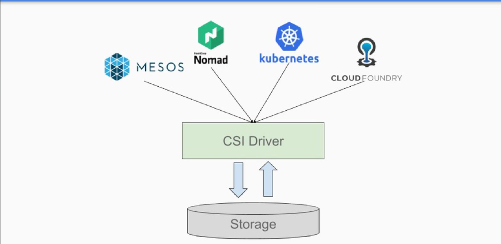
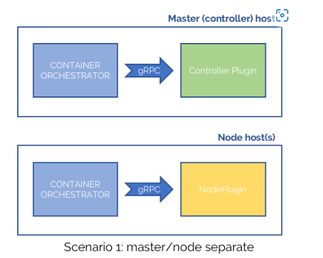
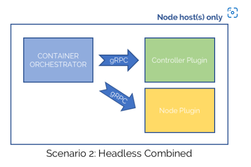
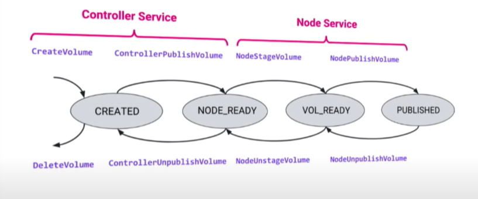
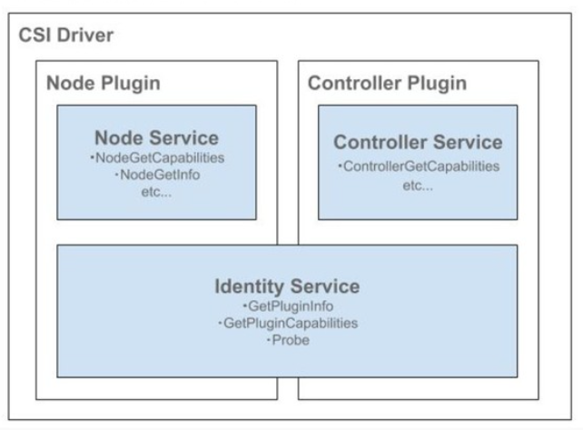
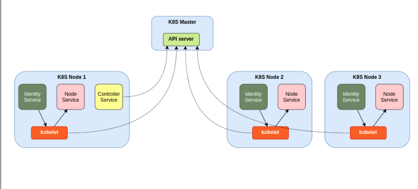

# Các Thuật Ngữ
- Volume: Một đơn vị lưu trữ sẽ được cung cấp bên trong thùng chứa được quản lý bằng CO, thông qua CSI.

- CO (Container Orchestration): Hệ thống điều phối vùng chứa, giao tiếp với các Plugin sử dụng các RPC dịch vụ CSI.

- SP(Storage Provider): Nhà cung cấp bộ nhớ, nhà cung cấp triển khai plugin CSI.
- RPC: Gọi thủ tục từ xa. Là cơ chế giao tiếp giữa 2 tiến trình. Thực hiện lời gọi thủ tục trên tiến trình khác giống như lời gọi thủ tục trong một tiến trình cục bộ. 
- Node: Máy chủ lưu trữ nơi khối lượng công việc của người dùng sẽ chạy, có thể nhận dạng duy nhất từ ​​quan điểm của một Plugin bằng ID nút.
- Plugin: một điểm cuối gRPC triển khai Dịch vụ CSI.
- gRPC : một RPC framework giúp bạn kết nối giữa các service trong hệ thống, nó hỗ trợ load balancing, tracing, health checking và authentication hỗ trợ từ mobile, trình duyệt cho tới back-end service.
- Workload: Đơn vị của "công việc" được lên lịch bởi một CO. Đây CÓ THỂ là một thùng chứa hoặc một tập hợp các thùng chứa.
# 1. Container Storage Interface (CSI) là gì?
- Giao diện lưu trữ vùng chứa (CSI) được phát triển như một tiêu chuẩn để hiển thị các hệ thống lưu trữ khối và lưu trữ tệp tùy theo khối lượng công việc được chứa trên các hệ thống điều phối vùng chứa (CO) như Kubernetes, Mesos, Nomad, Cloud Foundry.
- CSI về cơ bản là một giao diện (interface) giữa khối lượng công việc vùng chứa (container workloads) và bộ lưu trữ của bên thứ ba hỗ trợ việc `tạo` và `cấu hình` bộ lưu trữ liên tục bên ngoài bộ điều phối, đầu vào/đầu ra (I / O) của nó và các chức năng nâng cao như snapshots và cloning.
- CSI thay thế các plugin được phát triển trước đó trong quá trình phát triển Kubernetes, chẳng hạn như plugin khối lượng trong cây và plugin FlexVolume. CSI là Kubernetes API framework. CSI cho phép Kubernetes hỗ trợ linh hoạt các ứng dụng yêu cầu bộ nhớ liên tục. Nhà cung cấp dịch vụ lưu trữ sẽ cần viết CSI drivers áp dụng cho các thông số kỹ thuật của CSI framework và có thể lựa chọn các chức năng mà họ có thể và sẽ hỗ trợ. CSI là nền tảng của lưu trữ Kubernetes linh hoạt và có thể quản lý. 
- Tổng quan: 
    - CSI là về các hoạt động lưu trữ trong môi trường gốc của vùng chứa.
    - CSI là một đặc điểm kỹ thuật API để quản lý lưu trữ container.
    - CSI cũng là một giao diện vùng chứa tiêu chuẩn công nghiệp
    - Vì vậy, CSI là một API và phương pháp luận chung để giải quyết vấn đề lưu trữ như một tiêu chuẩn công nghiệp
    Nó là một lớp trừu tượng để quản lý khối lượng lưu trữ mà không phải lo lắng về các nội dung hoặc chi tiết cụ thể của bộ nhớ cơ bản phức tạp.

    

- CSI cho phép các nhà cung cấp dịch vụ lưu trữ:
    - Tự động tạo lưu trữ khi có yêu cầu.
    - Cung cấp bộ nhớ cho các vùng chứa ở bất cứ nơi nào chúng được lên lịch.
    - Tự động xóa bộ nhớ khi không còn cần thiết.  

# 2. Kiến trúc của CSI?
- CSI được chia thành một số kiến trúc thiết kế xác định cách triển khai các plugin như thế nào. Các kiến ​​trúc phù hợp với các triển khai CO điển hình có máy chủ chính (master host) và máy chủ nút (node host). Có 3 tình huống xảy ra như sau:
    - Master/Node với các plugin riêng rẽ cho cả bộ điều khiển và chức năng node.
    
     
    
    - "Headless" trong đó các plugin vẫn chạy riêng rẽ cho bộ điều khiển và node nhưng chỉ chạy trên máy chủ node.
    
    

    - Headless kết hợp, trong đó một plugin cung cấp bộ điều khiển và các khả năng node cùng nhau.
  
# 3. Vòng đời Volume (Volume Lifecycle)

  

# 4. Container Storage Interface (CSI Driver)

 

*Phần này chủ yếu mô tả giao diện giữa các CO và các Plugin*
- RPC Interface:
    - Một CO tương tác với một Plugin thông qua RPCs. Mỗi SP phải cung cấp:
        - Node Plugin: Điểm cuối gRPC phục vụ CSI RPCs phải được chạy trên Node, sau đó một volume do SP cung cấp sẽ được xuất bản. 
        - Controller Plugin: Một điểm cuối gRPC phục vụ CSI RPCs có thể được chạy ở bất cứ đâu.
        - Trong một số trường hợp, một điểm cuối gRPC có thể phục vụ tất cả CSI RPCs.
- Bên trong mỗi plugin có 3 dịch vụ xử lý các cuộc gọi RPC: 
    - Dịch vụ nhận dạng (Identity service) - được thực hiện bởi cả Plugin điều khiển và Plugin Node.
    - Dịch vụ điều khiển (Controller service) - chạy trên Plugin điều khiển.
    - Dịch vụ Node (Node service) - được thực hiện bởi Plugin Node.

- Sơ đồ dịch vụ:

  

```
service Identity {
  rpc GetPluginInfo(GetPluginInfoRequest)
    returns (GetPluginInfoResponse) {}

  rpc GetPluginCapabilities(GetPluginCapabilitiesRequest)
    returns (GetPluginCapabilitiesResponse) {}

  rpc Probe (ProbeRequest)
    returns (ProbeResponse) {}
}

service Controller {
  rpc CreateVolume (CreateVolumeRequest)
    returns (CreateVolumeResponse) {}

  rpc DeleteVolume (DeleteVolumeRequest)
    returns (DeleteVolumeResponse) {}

  rpc ControllerPublishVolume (ControllerPublishVolumeRequest)
    returns (ControllerPublishVolumeResponse) {}

  rpc ControllerUnpublishVolume (ControllerUnpublishVolumeRequest)
    returns (ControllerUnpublishVolumeResponse) {}

  rpc ValidateVolumeCapabilities (ValidateVolumeCapabilitiesRequest)
    returns (ValidateVolumeCapabilitiesResponse) {}

  rpc ListVolumes (ListVolumesRequest)
    returns (ListVolumesResponse) {}

  rpc GetCapacity (GetCapacityRequest)
    returns (GetCapacityResponse) {}

  rpc ControllerGetCapabilities (ControllerGetCapabilitiesRequest)
    returns (ControllerGetCapabilitiesResponse) {}

  rpc CreateSnapshot (CreateSnapshotRequest)
    returns (CreateSnapshotResponse) {}

  rpc DeleteSnapshot (DeleteSnapshotRequest)
    returns (DeleteSnapshotResponse) {}

  rpc ListSnapshots (ListSnapshotsRequest)
    returns (ListSnapshotsResponse) {}

  rpc ControllerExpandVolume (ControllerExpandVolumeRequest)
    returns (ControllerExpandVolumeResponse) {}

  rpc ControllerGetVolume (ControllerGetVolumeRequest)
    returns (ControllerGetVolumeResponse) {
        option (alpha_method) = true;
    }
}

service Node {
  rpc NodeStageVolume (NodeStageVolumeRequest)
    returns (NodeStageVolumeResponse) {}

  rpc NodeUnstageVolume (NodeUnstageVolumeRequest)
    returns (NodeUnstageVolumeResponse) {}

  rpc NodePublishVolume (NodePublishVolumeRequest)
    returns (NodePublishVolumeResponse) {}

  rpc NodeUnpublishVolume (NodeUnpublishVolumeRequest)
    returns (NodeUnpublishVolumeResponse) {}

  rpc NodeGetVolumeStats (NodeGetVolumeStatsRequest)
    returns (NodeGetVolumeStatsResponse) {}


  rpc NodeExpandVolume(NodeExpandVolumeRequest)
    returns (NodeExpandVolumeResponse) {}


  rpc NodeGetCapabilities (NodeGetCapabilitiesRequest)
    returns (NodeGetCapabilitiesResponse) {}

  rpc NodeGetInfo (NodeGetInfoRequest)
    returns (NodeGetInfoResponse) {}
}
```
## 4.1 Controller Service RPC
### 1. CreateVolume
- Một Plugin điều khiển phải thực hiện lệnh gọi RPC nếu nó có khả năng điều khiển CREATE_DELETE_VOLUME. RPC này sẽ được CO gọi để cung cấp một volume mới thay mặt cho người dùng. 
- Plugin có thể tạo 3 loại volume:
    - Volume trống. Khi plugin hỗ trợ khả năng tùy chọn CREATE_DELETE_VOLUME.
    - Từ một snapshot hiện có. Khi plugin hỗ trợ khả năng tùy chọn CREATE_DELETE_VOLUME và CREATE_DELETE_SNAPSHOT.
    - Từ một volume hiện có. Khi plugin hỗ trợ clone và báo cáo khả năng tùy chọn CREATE_DELETE_VOLUME và CLONE_VOLUME.
- Nếu như CO yêu cầu một volume được tạo ra từ snapshot hay volume hiện có và kích thước của volume yêu cầu lớn hơn bản gốc thì Plugin có thể từ chối cuộc gọi với lỗi OUT_OF_RANGE hoặc phải cung cấp một volume, khi được trình bày với workload bởi cuộc gọi NodePublish, có cả kích thước yêu cầu và chứa dữ liệu từ snapshot.
- Nếu như plugin không thể hoàn thành CreateVolume, nó phải trả về mã non-ok gRPCtrong trạng thái gRPC. Các mã lỗi gRPC sẽ được gửi tương ứng với từng trường hợp và CO phải thực hiện các hành vi khôi phục lỗi. 
### 2. ControllerPublishVolume
- Một plugin điều khiển phải thực hiện cuộ gọi RPC nếu nó có khả năng điều khiển PUBLISH_UNPUBLISH_VOLUME. RPC sẽ được gọi bởi CO khi nó muốn đặt 1 workload sử dụng volume trong một node. Plugin NÊN thực hiện công việc cần thiết để làm cho volume có sẵn trên nút nhất định. Plugin KHÔNG PHẢI cho rằng RPC này sẽ được thực thi trên nút nơi ổ đĩa sẽ được sử dụng. 
- Nếu hoạt động lỗi hoặc CO không biết liệu hoạt động có lỗi hay không, nó có thể chọn gọi ControllerPublishVolume lần nữa hoặc chọn gọi ControllerUnpublishVolume.
- Nếu như plugin không thể hoàn thành ControllerPublishVolume, nó phải trả về mã non-ok gRPCtrong trạng thái gRPC. Các mã lỗi gRPC sẽ được gửi tương ứng với từng trường hợp và CO phải thực hiện các hành vi khôi phục lỗi. 
### 3. ControllerUnpublishVolume
- Plugin điều khiển phải thực hiện cuộc gọi RPC nếu nó có khả năng điều khiển PUBLISH_UNPUBLISH_VOLUME. RPC này là hoạt động ngược lại của ControllerPublishVolume. Nó phải được gọi sau NodeUnstageVolume và NodeUnpublishVolume trong volume được gọi và thành công. Plugin NÊN thực hiện công việc cần thiết để làm cho volume sẵn sàng được sử dụng bởi một nút khác. Plugin KHÔNG PHẢI giả định rằng RPC này sẽ được thực thi trên nút mà volume đã được sử dụng trước đó.
- RPC này thường được gọi bởi CO khi khối lượng công việc sử dụng volume đang được chuyển đến một nút khác hoặc tất cả khối lượng công việc sử dụng volume trên một nút đã kết thúc.
- Nếu như plugin không thể hoàn thành ControllerUnpublishVolume, nó phải trả về mã non-ok gRPCtrong trạng thái gRPC. Các mã lỗi gRPC sẽ được gửi tương ứng với từng trường hợp và CO phải thực hiện các hành vi khôi phục lỗi. 
### 4. ValidateVolumeCapabilities.
- Một Plugin điều khiển phải thực hiện cuộc gọi RPC. RPC này được gọi bởi CO để kiểm tra xem một volume được cấp phép trước có tất cả các khả năng mà CO muốn hay không. Cuộc gọi RPC nên trả về `confirmed` chỉ nếu tất cả các khả năng được chỉ định được hỗ trợ.  Hành động này phải là `idempotent`.
- Nếu như plugin không thể hoàn thành ValidateVolumeCapabilities, nó phải trả về mã non-ok gRPCtrong trạng thái gRPC. Các mã lỗi gRPC sẽ được gửi tương ứng với từng trường hợp và CO phải thực hiện các hành vi khôi phục lỗi. 
### 5. ListVolumes
- Plugin điều khiển phải thực hiện cuộc gọi RPC nếu nó có khả năng điều khiển LIST_VOLUMES. Plugin nên trả về thông tin về thất cả các volume mà nó biết. Nếu các volume được tạo hoặc bị xóa trong khi CO đang đồng thời phân trang thông qua các kết quả ListVolumes thì CO CÓ THỂ thấy ​​các tập trùng lặp trong danh sách, không chứng kiến ​​các tập hiện có hoặc cả hai.
- Nếu như plugin không thể hoàn thành ListVolumes, nó phải trả về mã non-ok gRPCtrong trạng thái gRPC. Các mã lỗi gRPC sẽ được gửi tương ứng với từng trường hợp và CO phải thực hiện các hành vi khôi phục lỗi. 
### 6. GetCapacity
- Plugin điều khiển phải thực hiện cuộc gọi RPC nếu nó có khả năng điều khiển GET_CAPACITY. RPC cho phép CO truy vẫn khả năng lưu trữ mà bộ điều khiển cấp volumes.
- Nếu như plugin không thể hoàn thành GetCapacity, nó phải trả về mã non-ok gRPCtrong trạng thái gRPC
### 7. ControllerGetCapabilities
- Plugin trình điều khiển PHẢI thực hiện lệnh gọi RPC này. RPC này cho phép CO kiểm tra các khả năng được hỗ trợ của dịch vụ bộ điều khiển do Plugin cung cấp.
### 8. CreateSnapshot
- Plugin điều khiển phải thực hiện cuộc gọi RPC nếu nó có khả năng điều khiển CREATE_DELETE_SNAPSHOT. RPC này sẽ được gọi bởi CO để tạo một snapshot mới từ một volume nguồn thay mặt cho người dùng.
- Hành động này phải được `idempotent`. 
- Nếu lỗi xảy ra trước khi snapshot, CreateSnapshot NÊN trả về mã lỗi gRPC tương ứng phản ánh tình trạng lỗi.
- Snapshot CÓ THỂ được sử dụng làm nguồn để cung cấp volume mới. Thông báo CreateVolumeRequest CÓ THỂ chỉ định một tham số snapshot nguồn TÙY CHỌN. Hoàn nguyên snapshot, trong đó dữ liệu trong volume gốc bị xóa và được thay thế bằng dữ liệu trong snapshot, là một chức năng nâng cao không phải hệ thống lưu trữ nào cũng có thể hỗ trợ và do đó hiện đang nằm ngoài phạm vi.
## 4.2 Node Service RPC
### 1. NodeStageVolume.
- Một Plugin Node phải thực hiện cuộc gọi RPC nếu nó có khả năng Node STAGE_UNSTAGE_VOLUME.
- RPC này được gọi bởi CO trước khi volume được sử dụng bởi bất kỳ khối lượng công việc nào trên node bởi NodePublishVolume. RPC NÊN được gọi bởi CO khi một khối lượng công việc muốn sử dụng volume được chỉ định được đặt (đã lên lịch) trên node được chỉ định lần đầu tiên hoặc lần đầu tiên kể từ khi lệnh gọi NodeUnstageVolume cho volume được chỉ định được gọi và trả về thành công trên node đó.
- nếu RPC này thất bại, hoặc CO không biết liệu thất bại hay không, nó có thể chọn gọi lại NodeStageVolume hoặc chọn gọi NodeUnstageVolume.
- Nếu như plugin không thể hoàn thành NodeStageVolume, nó phải trả về mã non-ok gRPCtrong trạng thái gRPC.
### 2. NodeUnstageVolume
- Một Plugin Node phải thực hiện cuộc gọi RPC nếu nó có khả năng Node STAGE_UNSTAGE_VOLUME.
- RPC này là hoạt động ngược lại của NodeStageVolume. RPC này phải hoàn tác công việc bằng NodeStageVolume tương ứng. RPC nên được CO gọi một lần cho mỗi staging_target_path đã được thiết lập thành công qua NodeStageVolume.
- Nếu Plugin điều khiển tương ứng có PUBLISH_UNPUBLISH_VOLUME và Plugin Node có STAGE_UNSTAGE_VOLUME, CO phải đảm bảo RPC này được gọi và trả về thành công trước khi gọi ControllerUnpublishVolume cho node và volume đã cho. 
- RPC này CÓ THỂ được gọi bởi CO khi khối lượng công việc sử dụng volume đang được chuyển đến một nút khác hoặc tất cả khối lượng công việc sử dụng volume trên một nút đã kết thúc.
- Nếu RPC thất bại hoặc CO không biết liệu có thất bại hay không, có thể chọn NodeUnstageVolume lần nữa.
- Nếu như plugin không thể hoàn thành NodeUnStageVolume, nó phải trả về mã non-ok gRPCtrong trạng thái gRPC.
### 3. NodePublishVolume
- RPC này được gọi bởi CO khi một khối lượng công việc muốn sử dụng volume được chỉ định được đặt (theo lịch trình) trên một node.
- Nếu Plugin điều khiển có PUBLISH_UNPUBLISH_VOLUME, CO phải đảm bảo rằng RPC được gọi sau khi ControllerPublishVolume được gọi cho volume cho trước và trả về thành công.
- Nếu RPC thất bại hoặc CO không biết liệu có thất bại hay không, có thể chọn NodeStageVolume lần nữa hoặc gọi NodeUnpublishVolume.
- RPC có thể được gọi bởi CO nhiều lần trong cùng một node cho cùng volume với `target_path` có thể khác nhau và/hoặc các đối số khác nếu volume hỗ trợ chế độ truy cập MULTI_NODE_ hoặc SINGLE_MULTI_WRITER.
CO không nên gọi NodePublishVolume lần thứ hai với volume_capabilitity khác. Nếu điều này xảy ra, Plugin nên trả về FAILED_PRECONDITION.
- Nếu như plugin không thể hoàn thành NodePublishVolume, nó phải trả về mã non-ok gRPCtrong trạng thái gRPC.
### 4. NodeUnpublishVolume
- Một Node Plugin phải thực hiện gọi RPC. Đây là hoạt động ngược lại với NodePublishVolume. RPC phải hoàn tác công việc bởi NodePublishVolume tương ứng. RPC nên được gọi bởi CO ít nhất một lần cho từng target_path được thiết lập thành công thông qua NodePublishVolume. Nếu như Plugin điều khiển tương ứng có PUBLLISH_UNPUBLISH_VOLUME, CO nên phát hành tất cả NodeUnpublishVolume trước khi gọi ControllerUnpublishVolume cho node và volume cho trước. Plugin nên giả định rnawgf RPC sẽ được thực thi trong node mà volume đang được sử dụng.
- RPC này thường được gọi bởi CO khi khối lượng công việc sử dụng volume đang được chuyển đến một node khác hoặc tất cả khối lượng công việc sử dụng volume trên một node đã kết thúc.
- Hành động này phải là `idempotent` Nếu RPC thất bại, hoặc CO không biết liệu có thất bại hay không, nên chọn gọi NodeUnpublishVolume lần nữa. 
- Nếu như plugin không thể hoàn thành NodeUnpublishVolume, nó phải trả về mã non-ok gRPCtrong trạng thái gRPC.
### 5. NodeGetVolumeStats
- Một Node Plugin phải thực hiện gọi RPC nếu nó có GET_VOLUME_STATS hoặc VOLUME_CONDITION. Gọi NodeGetVolumeStats trả về thống kê dung lượng volume có sẵn cho volume.
- Nếu volume đang được sử dụng ở chế độ BlockVolume sau dó `used` và `available` có thể bị bỏ qua từ trường `usage` của NodeGetVolumeStatsResponse. Tương tự, thông tin inode cũng có thể bị bỏ qua từ NodeGetVolumeStatsResponse khi không có sẵn.
- Trường staging_target_path không được yêu cầu nhưng CO nên cung cấp. Các Plugin có thể sử dụng nó để xác định nếu volume_path là nơi xuất bản hoặc dàn dựng, và việc cài đặt trường này thành không trống cho phép plugin hoạt động với trạng thái được lưu trữ ít hơn trên node.
- Nếu như plugin không thể hoàn thành NodeGetVolumeStats, nó phải trả về mã non-ok gRPC trong trạng thái gRPC.
### 6. NodeGetCapabilities
- Một Node Plugin phải thực hiện gọi RPC. RPC cho phép CO kiểm tra khả năng được hỗ trợ của dịch vụ Node được cung cấp bởi Plugin.
- Nếu như plugin không thể hoàn thành NodeGetCapabilities, nó phải trả về mã non-ok gRPC trong trạng thái gRPC.
### 7. NodeGetInfo
- Một Node Plugin phải thực hiện gọi RPC nếu plugin có PUBLISH_UNPUBLISH_VOLUME. CO nên gọi RPC cho node muốn đặt workload. CO có thể gọi RPC nhiều lần cho node đã chọn tuy nhiên SP không mong đợi điều này. Kết quả của cuộc gọi này sẽ được sử dụng bởi CO trong ControllerPublishVolume.
- Nếu như plugin không thể hoàn thành NodeGetInfo, nó phải trả về mã non-ok gRPC trong trạng thái gRPC.
### 8. NodeExpandVolume
- Một Node Plugin phải thực hiện gọi RPC nếu plugin có EXPAND_VOLUME. Nó cho phép CO mở rộng volume trong một node. 
- NodeExpandVolume chỉ hỗ trợ mở rộng các volume node-published hoặc node-staged trên volume_path đã cho.
- Nếu plugin có STAGE_UNSTAGE_VOLUME sau đó:
  - NodeExpandVolume phải được gọi sau khi NodeStageVolume thành công.
  - NodeExpandVolume có thể được gọi trước hoặc sau NodePublishVolume.
- Nếu không NodeExpandVolume phải được gọi sau khi NodePublishVolume thành công.
- Nếu plugin chỉ hỗ trợ mở rộng thông qua VolumeExpansion.OFFLINE, sua đó volume phải được thực hiện offline trươc và mở rộng thông qua COntrollerExpandVolume và sua đó node-staged hoặc node-published trước khi nó được mở rộng bên trong node thông qua NodeExpandVolume.
- Plugin có thể sử dụng trường staging_target_path để xác định nếu volume_path là nơi volume được xuất bản hoặc hoặc dàn dựng, và việc cài đặt trường này thành không trống cho phép plugin hoạt động với trạng thái được lưu trữ ít hơn trên node.
## 4.3 Identity Service RPC
`Identity Service RPC` cho phép CO truy vấn một plugin về các khả năng, tình trạng và siêu dữ liệu khác. Quy trình chung của trường hợp thành công CÓ THỂ như sau:
- 1. CO truy vấn siêu dữ liệu qua Identity RPC.
- 2. CO truy vấn khả năng có sẵn của plugin.
- 3. CO truy vấn mức độ sẵn sàng của plugin
### 1. GetPluginInfo
- Nếu như plugin không thể hoàn thành GetPluginInfo, nó phải trả về mã non-ok gRPCtrong trạng thái gRPC. 
### 2. GetPluginCapabilities
- RPC BẮT BUỘC này cho phép CO truy vấn các khả năng được hỗ trợ của Plugin "nói chung": nó là tổng thể của tất cả các khả năng của tất cả các phiên bản của phần mềm Plugin, vì nó được dự định triển khai.
-  Tất cả các bản sao của cùng một phiên bản của Plugin nên trả về cùng một tập hợp các khả năng, bất kể cả hai: (a) trong đó các bản sao cũng được triển khai trên cluster; (b) RPC mà một cá thể đang phân phát.
- Nếu như plugin không thể hoàn thành GetPluginCâpbilities, nó phải trả về mã non-ok gRPCtrong trạng thái gRPC. 
### 3. Probe(ProbeRequest)
- Một Plugin phải thực hiện cuộc gọi RPC này. Tiện ích chính của Probe RPC là xác minh rằng plugin đang ở trạng thái khỏe mạnh và sẵn sàng.  Nếu một trạng thái không "khỏe mạnh" được báo cáo, thông qua một phản hồi không thành công, CO có thể thực hiện hành động với mục đích đưa plugin về trạng thái khỏe mạnh, có thể là:
    - Khởi động lại plugin container.
    - Thông báo cho người giám sát plugin.
- Plugin CÓ THỂ xác minh rằng nó có cấu hình, thiết bị, phụ thuộc và trình điều khiển phù hợp để chạy và trả về thành công nếu xác thực thành công. CO có thể gọi RPC này bắt cứ khi nào. 
- Nếu như plugin không thể hoàn thành Probe, nó phải trả về mã non-ok gRPCtrong trạng thái gRPC.
# 5. Mục đích của CSI trong MVP (Minimum Viable Product).
Để xác định một tiêu chuẩn công nghiệp “Giao diện lưu trữ vùng chứa” (CSI) sẽ cho phép các nhà cung cấp dịch vụ lưu trữ (SP) phát triển một plugin một lần và để nó hoạt động trên một số hệ thống điều phối vùng chứa (CO).
- Cho phép các tác giả SP viết một Plugin tuân thủ CSI “chỉ hoạt động” trên tất cả các CO triển khai CSI.
- Xác định API (RPC) cho phép: 
    - Cấp phép động và hủy cấp phép một volume.
    - Đính kèm hoặc tách một volume từ một node.
    - Gắn hoặc ngắt kết nối một volume từ một node.
    - Nhà cung cấp bộ nhớ cục bộ. 
    - Tạo và xóa một snapshot ( nguồn của snapshot là một volume).
    - Cung cấp một volume mới từ một snapshot.
- Xác định giao thức plugin RECOMMENDATIONS:
    - Mô tả một quy trình người giám sát cấu hình một Plugin.
    - Cân nhắc triển khai vùng chứa. 

# 6. Giao thức trong CSI.
## 1. Kết Nối
- Một CO sẽ giao tiếp với một Plugin sử dụng gRPC để kết nối dịch vụ  `Identity` và `Controller`, `Node`.
  - proto3 nên được sử dụng với gRPC.
  - Tất cả Plugin sẽ thực hiện REQUIRED Identity service RPCs. Hỗ trợ cho OPTINAL RPCs được báo cáo bởi các lệnh gọi RPC ControllerGetCapabilities và NodeGetCapabilities.
- CO sẽ cung cấp địa chỉ nghe cho Plugin bằng biến môi trường CSI_ENDPOINT. Các thành phần Plugin sẽ tạo, liên kết và lắng nghe RPCs theo địa chỉ nghe được chỉ định.
  - chỉ UNIX Domain Sockets có thể được sử dụng như điểm cuối. Điều này có thể sẽ thay đổi trong phiên bản tương lai của thông số kỹ thuật này để hỗ trợ các nền tảng không phải UNIX
- Tất cả các dịch vụ hỗ trợ RPC phải có sẵn ở địa chỉ nghe của Plugin.
## 2. Bảo Mật
- Người điều hành CO và Người giám sát plugin nên thực hiện các bước để đảm bảo rằng bất kỳ và tất cả thông tin liên lạc giữa CO và Dịch vụ plugin được bảo mật theo các phương pháp hay nhất.
- Liên lạc giữa CO và Plugin sẽ được truyền thông qua UNIX Domain Sockets.
  - gRPC tương thích với UNIX Domain Sockets; Nhà điều hành CO và Người giám sát plugin có trách nhiệm truy cập an toàn đúng cách vào Domain Socket bằng cách sử dụng ACL hệ thống tệp của hệ điều hành và/hoặc công cụ ngữ cảnh bảo mật dành riêng cho hệ điều hành khác.
  - SP đang cung cấp thiết bị điều khiển plugin độc lập hoặc các thành phần từ xa khác không tương thích với UNIX Domain Socket PHẢI cung cấp cấu phần phần mềm proxy giao tiếp giữa UNIX Domain Socket và (các) thành phần từ xa. Các thành phần proxy vận chuyển thông tin liên lạc qua mạng IP SẼ chịu trách nhiệm bảo mật thông tin liên lạc qua các mạng đó.
- Cả CO và Plugin nên tránh rò rỉ thông tin nhạy cảm
## 3. Gỡ Lỗi
- Gỡ lỗi và truy tìm được hỗ trợ bởi bên ngoài, Các phần bổ sung và phần mở rộng độc lập với CSI cho gRPC APIs, chẳng hạn như `OpenTracing`


